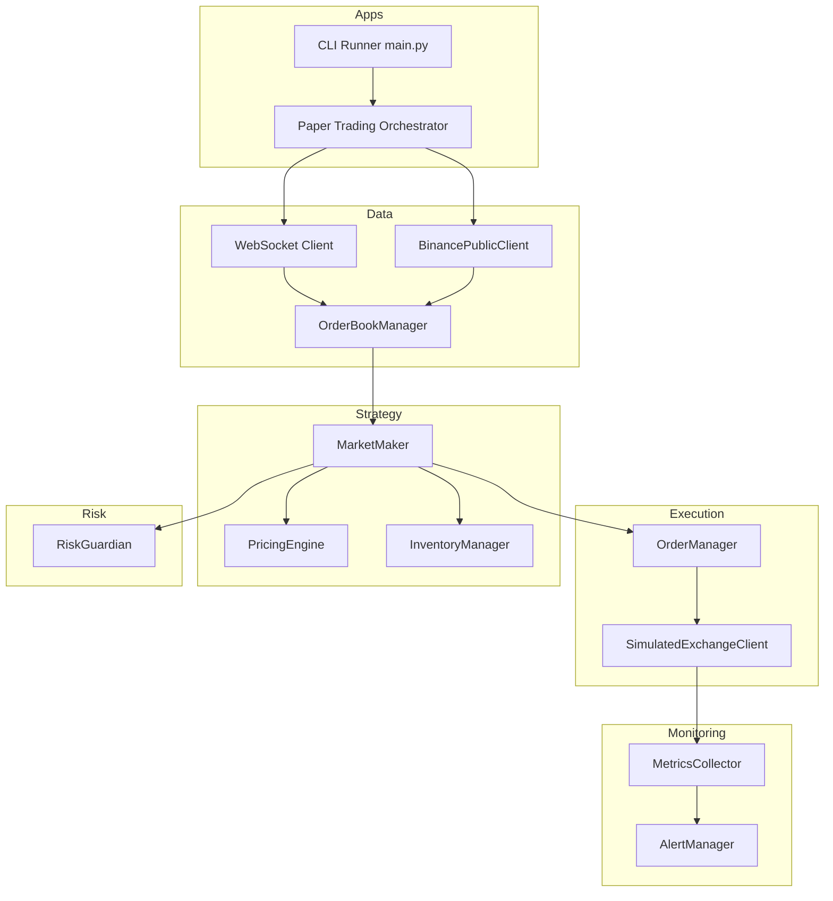

# Mimari Tasarım ve Geliştirme Sırası

## 1. Modül Yapısı: Genel Değerlendirme

Yapı olarak katmanlandırma, kurumsal bir trading sisteminin katman mimarisiyle birebir örtüşüyor:

```
Core (Domain Models, Config)
  ↓
Risk (Pre-trade Controls)
  ↓
Data (Market Data Client & Order Book)
  ↓
Execution (Order Sending, Cancel, Routing)
  ↓
Strategy (Market Making Logic)
  ↓
Monitoring (Log, Metrics, Alerting)
  ↓
Backtest (Simulation & Backtest Engine)
  ↓
Apps (CLI / Runner Scripts)
```

**Mimari Yönden Doğru Eksen:**
- Core domain → risk → market data & execution → strategy → monitoring/backtest
- Risk ve pre-trade kontroller ayrı bir katman olarak tasarlanıyor
- Execution ve stratejiden bağımsız risk katmanı
- Endüstri standardına uygun yapı

---

## 2. Geliştirme Sırası

### Önerilen Sıra

1. **Core** - Domain modelleri, config, constants
2. **Data** - Binance client + websocket + orderbook modeli
3. **Execution (skeleton)** - Interface'ler ve temel yapı
4. **Risk** - Limits, guardian, metrics
5. **Strategy** - Market maker, pricing, inventory
6. **Monitoring** - Log, metrics, alerting
7. **Backtest** - Simulation engine
8. **Apps** - CLI / runner scripts

### Neden Bu Sıra?

#### 1. Core Önce
- `config.py`, `models.py`, `constants.py` → tüm sistemin sözlüğünü burada tanımlarız
- Order, Trade, Position, PnL, RiskLimit, SymbolConfig, vb.
- Risk, Data, Strategy hepsi bu domain modellerine dayanacak

#### 2. Data'yı Risk'ten Önce
- Risk modülü şunlara ihtiyaç duyacak:
  - Anlık pozisyon (Position)
  - Gerçekleşmiş PnL
  - Açık emirler
  - Market fiyatı (mark-to-market için)
- Bunların kaynağı **Data + Execution**
- En azından Data & Execution'ın **interface**'lerini hazır görmek, Risk tarafında daha gerçekçi guardian fonksiyonları yazmayı sağlar

#### 3. Execution'ın İskeletini Erken Kurmak
- `order_manager.py` ve `routing.py`'yi en azından interface düzeyinde tanımlamak
- Risk guardian: "emir `Order` objesi olarak buradan geçer, şu kontroller uygulanır, sonra Execution'a gider" şeklinde netleşir
- Veri akışı: `Strategy → Risk.Guardian → Execution.Router → BinanceClient`

#### 4. Risk'i İskeletin Üzerine "Gatekeeper" Olarak Oturtmak
- `guardian.py` içinde:
  - `check_order_limits(order, position, risk_config)`
  - `check_daily_loss(pnl_state)`
  - `check_inventory_limits(position, risk_config)`
- Bunların hepsi core modeller + data/execution interface'lerini kullanır

#### 5. Strategy En Sona
- Strategy, Core + Data + Risk + Execution katmanlarının üzerine oturan "beyin"
- Altta altyapı hazır değilken strateji yazmak; koda sonra çok geri dönmeyi gerektirir

---

## 3. Modül Modül Kısa Yönlendirme

### 3.1 Core

**`config.py`**
- Pydantic `BaseSettings` ile:
  - API key/secret
  - Base URL (testnet/live)
  - Risk parametreleri (daily_loss_limit, max_inventory_pct vs.)
  - Strategy parametreleri (spread bps, order_size_pct, refresh_ms, vb.)

**`models.py`**
- `Order`, `Trade`, `Position`, `Quote`, `OrderBookSnapshot`, `PnLState`, `RiskLimits`, `SymbolConfig` vs.
- Bunları **borsa bağımsız** tasarla

**`constants.py`**
- Varsayılan spread, fee, risk eşiği, metric thresholds vs.

---

### 3.2 Data

**`exchange.py`**
- `IExchangeClient` interface - Exchange client'lar için abstract base class
  - `get_orderbook`, `submit_order`, `cancel_order`, `get_open_orders`, `get_positions`, `get_trades`
  - Gerçek exchange (Binance) ve simulated exchange için ortak interface

**`binance_client.py`**
- HTTP istek wrapper'ı (REST):
  - `get_orderbook`, `get_ticker`, `get_positions`, `get_open_orders`, `submit_order`, `cancel_order` vb.
  - `IExchangeClient` interface'ini implement eder

**`binance_public_client.py`**
- Public API client (KYC gerektirmez):
  - Sadece `get_orderbook` için kullanılır
  - Paper trading modunda canlı market data için kullanılır

**`websocket.py`**
- Public stream (order book, trades) + private stream (fills, order updates)
- Reconnect mekanizması ve error handling

**`orderbook.py`**
- L1/L2 snapshot modeli, mid, spread hesaplama, basit update mekanizması

---

### 3.3 Execution

**`order_manager.py`**
- `submit_order(order: Order)` - `IExchangeClient` interface üzerinden emir gönderir
- `cancel_order(order_id)` - Emir iptal
- `sync_open_orders()` - Açık emirleri senkronize et

**`routing.py`**
- Hangi markete / hangi client'a gönderileceğini belirleyen basit router

**`simulated_exchange.py`**
- `SimulatedExchangeClient` - Paper trading için lokal exchange simülasyonu
  - Order matching mantığı
  - Position ve PnL tracking
  - `IExchangeClient` interface'ini implement eder
  - Live Paper Exchange modunda kullanılır

---

### 3.4 Risk

**`limits.py`**
- Günlük loss limit, MDD, symbol bazlı pozisyon limitleri için fonksiyonlar

**`guardian.py`**
- Her yeni emir için:
  - Notional check, price band check, inventory check, daily loss check
- Kill switch senaryoları

**`metrics.py`**
- Sharpe, MDD, spread PnL, cancel/trade ratio hesaplayan yardımcı fonksiyonlar

---

### 3.5 Strategy

**`pricing.py`**
- Mid, spread, inventory skew bazlı bid/ask hesaplama

**`inventory.py`**
- Target inventory, soft/hard band davranışı

**`market_maker.py`**
- Order book event'i geldiğinde → pricing → risk check → execution pipeline'ı

---

### 3.6 Monitoring

**`logger.py`**
- Structured logging

**`metrics.py`**
- Metrik toplama ve raporlama

**`alerts.py`**
- Risk eşikleri için alerting

---

### 3.7 Backtest

**`engine.py`**
- Simülasyon motoru

**`data_loader.py`**
- Historical data yükleme

---

### 3.8 Apps

**`main.py`**
- CLI runner

**`paper_trading.py`**
- Paper trading modu

---

## 4. Veri Akışı

### High-level Diagram (Mermaid)



### Normal İşlem Akışı (Live Trading)

```
Order Book Update (Data)
  ↓
Strategy.pricing.compute_quotes()
  ↓
Strategy.inventory.apply_skew()
  ↓
Risk.guardian.check_order_limits()
  ↓
Risk.guardian.check_inventory_limits()
  ↓
Risk.guardian.check_daily_loss()
  ↓
Execution.order_manager.submit_order()
  ↓
Execution.routing.route_to_exchange()
  ↓
Data.binance_client.submit_order() (IExchangeClient)
```

### Paper Trading Akışı (Live Data + Local Simulation)

```
Binance Public API (Order Book)
  ↓
BinancePublicClient.get_orderbook()
  ↓
WebSocket Stream (Live Market Data)
  ↓
SimulatedExchangeClient.on_orderbook_update()
  ↓
Strategy.pricing.compute_quotes()
  ↓
Risk.guardian.check_order_limits()
  ↓
SimulatedExchangeClient.submit_order() (Lokal)
  ↓
SimulatedExchangeClient._match_orders() (Fill Simulation)
  ↓
Position & PnL Update (Lokal)
```

### Risk Event Akışı

```
Risk Event Detected (daily_loss, MDD, inventory_limit)
  ↓
Risk.guardian.trigger_kill_switch()
  ↓
Execution.order_manager.cancel_all_orders()
  ↓
Execution.order_manager.flatten_inventory()
  ↓
Monitoring.alerts.send_alert()
```

---

## 5. Bağımlılık Grafiği

```
Apps
  ↓
Strategy → Risk → Execution → Data
  ↓         ↓
Monitoring  Core
  ↓
Backtest
```

**Bağımlılık Kuralları:**
- Core: Hiçbir modüle bağımlı değil
  - `IExchangeClient` interface'i Core'da tanımlı (exchange abstraction)
- Data: Sadece Core'a bağımlı
  - `BinanceClient`, `BinancePublicClient` → `IExchangeClient` implement eder
- Execution: Core + Data'ya bağımlı
  - `SimulatedExchangeClient` → `IExchangeClient` implement eder
  - `OrderManager` → `IExchangeClient` kullanır (exchange-agnostic)
- Risk: Core + Data + Execution (interface) bağımlı
- Strategy: Core + Data + Risk + Execution bağımlı
  - `MarketMaker` → `IExchangeClient` kullanır (exchange-agnostic)
- Monitoring: Core + Data + Risk + Strategy bağımlı
- Backtest: Core + Data + Strategy bağımlı
  - `BacktestEngine` → `SimulatedExchangeClient` kullanır
- Apps: Tüm modüllere bağımlı
  - `paper_trading.py` → `BinancePublicClient` + `SimulatedExchangeClient` kombinasyonu

---

## 6. Özet

✅ **Modül yapısı sağlıklı** - scaled-up bir MM altyapısı için uygun

✅ **Sıra revizyonu:**
- Core → Data → Execution (skeleton) → Risk → Strategy → Monitoring → Backtest → Apps

✅ **Faydalar:**
- Risk ve strateji, gerçek veri akışı ve execution interface'leri üzerinde şekillenir
- Daha az refactor ile "etkili ve sorunsuz çalışan" hedefe yaklaşılır
- Her katman, altındaki katmanların interface'lerini kullanarak gerçekçi şekilde geliştirilir

